# 面试理论

## JavaScript

### JS的组成

ECMAScript，BOM（浏览器模型），DOM（文档对象模型）。

### ES6新增特性

- 块级作用域，let，const
  - 不存在变量提升，有块级作用域概念，不能在同一个块级作用域重复声明
- 类语法糖class
- 基本数据类型Symbol
- 解构赋值，扩展运算符，函数参数默认值
- 数组新增API
- generator，* yield
  - 协程，多个线程互相协作，完成异步任务。

  ```js
  function * fun(x) {
    console.log('start')
    yield x * 2
    return x
  }
  const f = fun(1)// 此时不会立即执行
  f.next() // 此时开始执行，输出start
  ```

- Promise
  - 异步编程方案，解决回调地狱问题，原型上有then、catch，链式调用把异步操作队列化
  - ES7提供了async、await，进一步通过同步函数的方式支持异步编程。
- 模块化，import，export
- Set、Map数据结构
  - Map结构是二维数组，是 ```key:value```键值对，可以使用```set、get、delete、has```等方法操作，它的key可以是任意类型。
  - Set的值就是key，没有value，value就是key，可以使用```[...new Set(arr)]```给数组去重。
- 箭头函数
  - 不能作为构造函数使用，不能使用new，没有arguments关键字，不能使用call、apply、bind改变this指向。
  - this指向外层第一个函数的this
  - 没有原型，箭头函数.prototype为undefined

### 检查数据类型

1. typeof，一般用来检查基本数据类型。
2. instanceof，一般用来检查引用数据类型。
3. constructor，可以检查基本和引用数据类型，但是如果修改了原形，就会导致结果错误。
4. Object.prototype.toString.call()，可以检查所有数据类型。

### 闭包

什么是闭包？函数嵌套函数，内部函数被外部函数返回并保存下来时，就会产生闭包。
特点：可以重复利用变量，并且变量不会污染全局，一直保存在内存中，不会被回收。

缺点：闭包多时，会消耗内存，影响性能，IE浏览器中会导致内存泄漏。

使用场景：防抖，节流。

### 内存泄漏

因为垃圾回收机制，js里面已经分配内存地址的对象，长时间占用内存，无法释放，导致运行速度慢，甚至崩溃。

因素：过度闭包、未清除的定时器。

### 事件委托，冒泡和捕获

事件委托又叫事件代理，利用时间冒泡机制，字元素的事件会冒泡到父元素，直接在父元素绑定事件，就可以通过e.target拿到当前触发事件的子元素。子元素本身可以用e.stopPropagation()阻止冒泡。

优点：提高性能，减少事件绑定，减少内存占用。

父元素绑定事件可以用addEventListener(eventName, funcName, true/false)，第三个参数 默认是false冒泡，可以设置为true捕获。

e.target是触发的元素，e.currentTarget是绑定的元素。假如有abcd四层元素，第三个参数为false，点击时，target和currentTarget值分别是 dddd和 dcba。如果第三个参数是true，值分别是 dddd和abcd。这是冒泡和捕获的区别。

### 原型，原型链

原形prototype，只有函数有，其他类型没有。__proto__指针，所有类型都有，指向构造函数的原形，每一层的指针组成了原型链。

### object的方法

- Object.assign方法实行的是浅拷贝，而不是深拷贝。也就是说，如果源对象某个属性的值是对象，那么目标对象拷贝得到的是这个对象的引用。同名属性会替换。
- Object.create(parent, {z : { writable:true, configurable:true, value: "newAdd"} }) 使用指定的原型对象及其属性去创建一个新的对象。
- Object.defineProperty(Object , ‘is’,{value:’a’, configurable:true, enumerable: false, writable: true}) 在一个对象上定义一个新属性，或者修改一个对象的现有属性， 并返回这个对象。
- Object.keys(obj) ，Object.values(obj)，Object.entries(obj)返回一个由一个给定对象的自身可枚举属性/属性值/键值对组成的数组，排列顺序和使用 for...in 循环遍历该对象时返回的顺序一致。与for in的区别是for in循环会枚举原型链上的属性。
- obj.hasOwnProperty('name') 判断对象自身属性中是否具有指定的属性。
- Object.getPrototypeOf()返回指定对象的原型（内部[[Prototype]]属性的值，即__proto__，而非对象的prototype。
- Object. isPrototypeOf()判断一个对象是否存在于另一个对象的原型链上。
- Object.setPrototypeOf(obj,prototype) 设置对象的原型对象。
- Object.is()判断两个值是否相同。如果两个值都是undefined/null/true/false/NaN/指向同一个对象，则两个值相同。

### script标签上的属性

script标签上没有async和defer属性时，浏览器会立刻加载并执行脚本。

如果有async属性，加载和渲染后面元素的过程将和script的加载和执行并行（异步）。如果有defer属性，会跟async一样，异步加载，但是会在所有元素解析完成之后才去执行。

### setTimeOut最小执行时间

在 JavaScript 中，setTimeout 函数的最小执行时间取决于浏览器或者宿主环境的实现。根据 HTML 标准，规定 setTimeout 的最短时间间隔是 4 毫秒，也就是说，指定的回调函数至少会在指定时间之后的 4 毫秒内执行。setInterval最小10ms。

### call、apply、bind

都是改变this指向和函数的调用，call和apply功能类似，只是传参数的方法不同。
call传递的是参数列表，apply传递的是数组。
bind传递参数之后不会立即执行，它会返回一个改变了this指向的函数，这个函数还是可以传参数，所以它需要bind()()。

call的性能比apply好一点，所以call用的多，可以用扩展运算符代替apply。

### this指向

- 在Javascript中，this指向函数执行时的当前对象。

  ```js
  // 在执行foo的时候，执行环境就是doFoo函数，执行环境为全局。所以，foo中的this是指向window的，所以会打印出2。
  function foo() {
    console.log( this.a );
  }
  function doFoo() {
    foo();
  }
  var obj = {
    a: 1,
    doFoo: doFoo
  };
  var a = 2;
  obj.doFoo()
  ```

- 箭头函数时不绑定this的，它的this来自原其父级所处的上下文。

  ```js
  // 首先会打印全局中的 a 的值10。后面虽然让say方法指向了另外一个对象，但是仍不能改变箭头函数的特性，它的this仍然是指向全局的，所以依旧会输出10。
  var a = 10
  var obj = {
    a: 20,
    say: () => {
      console.log(this.a)
    }
  }
  obj.say()
  var anotherObj = { a: 30 }
  obj.say.apply(anotherObj)

  // 但是，如果是普通函数，那么就会有完全不一样的结果：
  var a = 10  
  var obj = {  
    a: 20,  
    say(){
      console.log(this.a)  
    }  
  }  
  obj.say()
  var anotherObj={a:30}
  obj.say.apply(anotherObj)
  // 输出结果：20 30
  ```

- 根据ECMAScript262规范规定：如果第一个参数传入的对象调用者是null或者undefined，call方法将把全局对象（浏览器上是window对象）作为this的值。但是在严格模式中，null 就是 null，undefined 就是 undefined
  
  ```js
  function a() {
    console.log(this);
  }
  a.call(null); // 打印结果：window对象
  ```

- 立即执行匿名函数表达式是由window调用的，this指向window。
- this优先级：new绑定 > 显式绑定 > 隐式绑定 > 默认绑定。

  ```js
  function foo(something){
    this.a = something
  }
  var obj1 = {}
  var bar = foo.bind(obj1);
  bar(2);
  console.log(obj1.a); // 2
  var baz = new bar(3);
  console.log(obj1.a); // 2
  console.log(baz.a); // 3
  ```

### 执行环境&变量提升

JS中变量的作用域链与定义时的环境有关，与执行时无关。执行环境只会改变this指向、传递的参数、全局变量等。

```js
 var a=3;
 function c(){
    alert(a); // 定义时 a的值就是window全局的3，所以会输出3
 }
 (function(){
  var a=4;
  c();
 })();
```

在 JavaScript中， Function 和 var 都会被提升（变量提升）。

```js
var friendName = 'World';
(function() {
  // 这儿是函数内部自己的块级作用域，因为 if里面使用var定义了friendName，会进行变量提升，
  // 此时if访问typeof friendName 会是undefined，所以输出结果是Goodbye Jack
  if (typeof friendName === 'undefined') {
    var friendName = 'Jack';
    console.log('Goodbye ' + friendName);
  } else {
    console.log('Hello ' + friendName);
  }
})();
```

### JS == 判断转化

转化规则：

N表示toNumber，P表示转为原始类型，对于一个对象来说，ToP等价于 先obj.valueOf，如果结果为原始值就返回，否则继续执行obj.toString，如果结果为原始类型就返回，否则抛出异常。

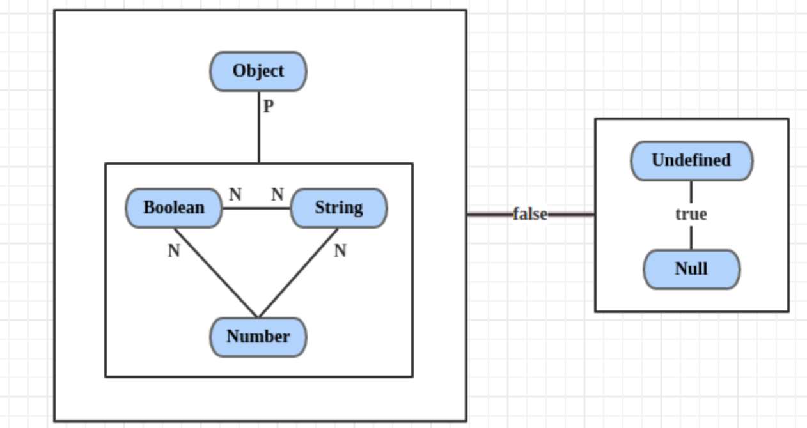

- undefined == null，结果是true。且它俩与所有其他值比较的结果都是false。
- String == Boolean，需要两个操作数同时转为Number。
- String/Boolean == Number，需要String/Boolean转为Number。
- Object == Primitive(基本类型)，需要Object转为Primitive(具体通过valueOf和toString方法)。

### JS深拷贝

- 扩展运算符，只能浅拷贝一层。
- JSON.parse(JSON.stringify())，深拷贝，不会拷贝内部的函数。

### 事件循环宏任务和微任务

JS是一个单线程的脚本语言，事件循环的概念非常简单。它是一个在 JavaScript 引擎等待任务，执行任务和进入休眠状态等待更多任务这几个状态之间转换的无限循环。JavaScript 引擎大多数时候不执行任何操作，它仅在脚本/处理程序/事件激活时执行。

常见的宏任务有：script (可以理解为外层同步代码)、setTimeout/setInterval、UI rendering/UI事件、postMessage、MessageChannel、setImmediate、I/O（Node.js）。

任务示例：

- 当外部脚本 script 加载完成时，任务就是执行它。
- 当用户移动鼠标时，任务就是派生出 mousemove 事件和执行处理程序。
- 当安排的（scheduled）setTimeout 时间到达时，任务就是执行其回调。

一个任务到来时，引擎可能正处于繁忙状态，那么这个任务就会被排入队列。多个任务组成了一个队列，即所谓的“宏任务队列”（v8 术语）。例如，当引擎正在忙于执行一段 script 时，用户可能会移动鼠标而产生 mousemove 事件，setTimeout 或许也刚好到期，以及其他任务，这些任务组成了一个队列，如下图：

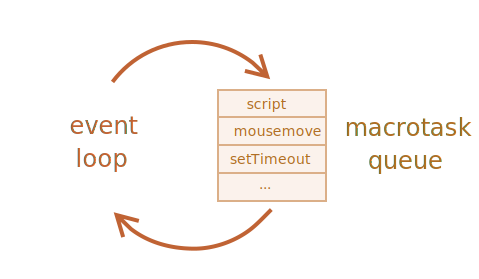

队列中的任务基于“先进先出”的原则执行。当浏览器引擎执行完 script 后，它会处理 mousemove 事件，然后处理 setTimeout 处理程序，依此类推。

微任务仅来自于我们的代码。它们通常是由 promise 创建的：对 .then/catch/finally 处理程序的执行会成为微任务。微任务也被用于 await 的“幕后”，因为它是 promise 处理的另一种形式。同时常见的微任务有 process.nextTick（Node.js）、Object.observe（已废弃；Proxy 对象替代）、MutaionObserver。

宏任务和微任务循环算法：

1. 从 宏任务 队列（例如 “script”）中出队（dequeue）并执行最早的任务。
2. 执行所有 微任务：
    - 当微任务队列非空时：出队（dequeue）并执行最早的微任务。
3. 如果有变更，则将变更渲染出来。
4. 如果宏任务队列为空，则休眠直到出现宏任务。
5. 转到步骤 1。
6. 每一个宏任务执行完都需要去检查微任务队列是否为空，为空再去走下一个宏任务。

```js
console.log(1);
setTimeout(() => console.log(2));
Promise.resolve().then(() => console.log(3));
Promise.resolve().then(() => Promise.resolve().then(() => console.log('a')));
Promise.resolve().then(() => console.log(5));
setTimeout(() => console.log(6));
console.log(7);
// 执行结果：1，7，3，5，a，2，6
/**
 * 1和7的console正常js执行，遇到Set 2 ，插入到宏队列，Pro 3到微队列，下一行的Pro插入微队列，Pro 5插入微队列，Set 6宏队列。
 * 1，7正常输出，最早的宏队列清空，开始执行微队列，输出3，下一行的Pro执行结果还是Pro 插入微队列，Pro 5输出，此时微队列还剩下Pro a，输出，微队列清空，执行宏队列，Set 2，Set 6。
 */
```

可以使用零延迟的 setTimeout(f) 安排（schedule）一个新的 宏任务，它可被用于将繁重的计算任务拆分成多个部分，以使浏览器能够对用户事件作出反应，并在任务的各部分之间显示任务进度。此外，也被用于在事件处理程序中，将一个行为（action）安排（schedule）在事件被完全处理（冒泡完成）后。

可以使用 queueMicrotask(f) 安排一个新的 微任务，在微任务之间没有 UI 或网络事件的处理：它们一个立即接一个地执行。所以，我们可以使用 queueMicrotask 来在保持环境状态一致的情况下，异步地执行一个函数。例如：

```js
console.log(1);
setTimeout(() => console.log(2));
Promise.resolve().then(() => console.log(3));
Promise.resolve().then(() => queueMicrotask(() => console.log('a')));
Promise.resolve().then(() => console.log(5));
setTimeout(() => console.log(6));
console.log(7);
// 执行结果：1，7，3，5，a，2，6

const promise = new Promise((resolve, reject) => {
  console.log(1);
  setTimeout(() => {
    console.log("timerStart");
    resolve("success");
    console.log("timerEnd");
  }, 0);
  console.log(2);
});
promise.then((res) => {
  console.log(res);
});
console.log(4);
// 1,2,4, timerStart, timerEnd, success
/**
 * 首先遇到Promise构造函数，会先执行里面的内容，打印1；遇到定时器steTimeout，它是一个宏任务，放入宏任务队列；继续向下执行，打印出2；
 * 由于Promise的状态此时还是pending，所以promise.then先不执行；
 * 继续执行下面的同步任务，打印出4；
 * 此时微任务队列没有任务，继续执行下一轮宏任务，执行steTimeout；
 * 首先执行timerStart，然后遇到了resolve，将promise的状态改为resolved且保存结果并将之前的promise.then推入微任务队列，再执行timerEnd；
 * 执行完这个宏任务，就去执行微任务promise.then，打印出resolve的结果。
 */

// Promise的状态在发生变化之后，就不会再发生变化
const promise = new Promise((resolve, reject) => {
    resolve('success1');
    reject('error');
    resolve('success2');
});
promise.then((res) => {
    console.log('then:', res);
}).catch((err) => {
    console.log('catch:', err);
})
// 执行结果为：then:success1，开始状态由pending变为resolve，说明已经变为已完成状态，下面的两个状态的就不会再执行，同时下面的catch也不会捕获到错误。

// Promise.resolve方法的参数如果是一个原始值，或者是一个不具有then方法的对象，则Promise.resolve方法返回一个新的Promise对象，状态为resolved，Promise.resolve方法的参数，会同时传给回调函数。
Promise.resolve(1)
  .then(2)
  .then(Promise.resolve(3))
  .then(console.log)
// 执行结果：1，Promise {<fulfilled>: undefined}

```

#### Web Workers

对于不应该阻塞事件循环的耗时长的繁重计算任务，我们可以使用 Web Workers，这是在另一个并行线程中运行代码的方式。Web Workers 可以与主线程交换消息，但是它们具有自己的变量和事件循环。Web Workers 没有访问 DOM 的权限，因此，它们对于同时使用多个 CPU 内核的计算非常有用。

## 性能优化

### 网络优化

- 将请求推迟到需要时再发送
- 合并国际化请求
- 静态资源CDN
- 对图片要求不严格的进行图片压缩，合并精灵图
- 部署之后，静态资源走协商缓存
- 图片先展示默认图片，延迟或用到时再加载对应图片

### 渲染优化

浏览器拿到JS和CSS资源之后，第一步就是构建两个对象模型：DOM对象和CSSOM对象。第二步需要两个对象进行合并，构建渲染树，合并过程中，display：none的元素会被去掉，只留下最终显示在页面上的节点，有了这棵树之后，浏览器就知道每个节点是什么尺寸，要把它画在什么位置。

#### 重排（也叫布局、回流）和重绘

重排就是根据盒模型计算每个节点的大小、位置，重绘就是像素化每个节点的过程。

会导致重排的操作：

- 添加/删除元素
- 修改offsetLeft,scrollTop,clientWith
- 移动元素位置
- 修改浏览器大小，字体大小

应该尽量避免使用会导致回流的操作，提高页面性能。如果有批量修改布局的操作，应该读写分离，先批量处理读的操作，再批量进行写的操作，FastDom是专门处理这种情况的利器，利用window.requestAnimationFrame方法，同时FastDom也可以更好的帮助项目管理dom操作。

复合：为了提高绘制的效率，浏览器才有了复合，主要作用就是把页面拆解成不同的图层，当页面在视觉上发生变化时，这些变化其实只会影响某一个图层，其他图层不受影响，更高效的完成绘制。拆分图层默认情况下是浏览器决定的，浏览器主要分析元素之间是否互相影响，如果某些元素对其他元素造成的影响很大，就会被浏览器提取成单独的图层。我们也可以主动的把某些元素提取到单独的图层，但是也不是拆分越多越好，因为图层越多开销也越高，从而适得其反影响网页的性能。因此只把特定的，能达到效果的元素提到一个图层中。在元素上设置willChange属性值为'transform',这样浏览器就知道这个元素应该被提取到一个单独的图层里。

```js
// 以下几个属性只会触发复合而不去触发重绘。
transform: translate(npx,npx);
transform: scale(n);
transform: rotate(ndeg);
opacity: 0...1;

// 提取到一个单独的图层里
root: {
  margin: theme.spacing(1),
  willChange: 'transform'
}
```

当我们使用以上属性的时候，如果可以把它们所涉及到的元素提取到一个图层，那么这些元素的发生视觉上变化的时候就只会触发复合，而不会触发布局和重绘。

#### 高频事件防抖节流

某些事件触发频率非常高，甚至会超过帧的刷新速率。比如滚动事件、touch事件等，这类事件在一帧里会触发多次。导致浏览器在一帧里对这类事件进行多次响应，如果它们对应的事件处理函数消耗比较高，那么这一帧里任务就很繁重。实际上一帧里并不需要处理多次，比如滚动，我们只关心最后滚动到哪里。而整个过程中的其他滚动会导致任务量过重，就不能保证一帧能在16ms内完成，就会导致页面卡顿(抖动)。

解决页面卡顿大利器requestAnimationFrame，首先看一下帧的生命周期：

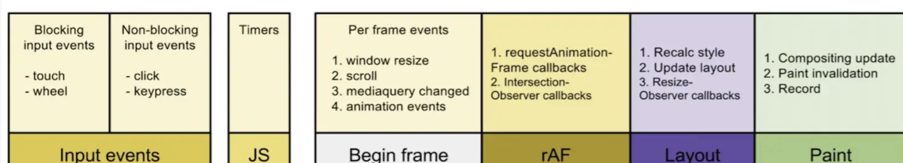

事件触发js触发视觉上的变化，此时一帧就要开始了，在layout和paint之前会调用rAF。也就是说requestAnimationFrame是在布局和绘制之前做的事情。

```js
// 去抖动(页面卡顿)
function changeWidth (rand) {
  let cards = document.getElementsByClassName('className')
    for(let i =0; i < cards.length; i++) {
      // js批量修改宽度，触发重排布局
        cards[i].style.width = ((Math.sin(rand / 1000) + 1)*5) + 'px'
      }
  }
  let ticking = false
  window.addEventListener('pointermove',(e) => {
      let pos = e.clientX;
      // 防止一帧内多次触发事件
      if(ticking) return;
      ticking = true;
      // 把要触发的任务changeWidth包在requestAnimationFrame里面
      window.requestAnimationFrame(() => {
          changeWidth(pos);
          ticking = false;
      });
  })
```

### 代码优化

我门的代码有javascript、html、css、图片、文字等。其中javascript的开销是最大的。除了加载过程中的开销，js还会经历解析和编译过程，然后再执行，都是耗时的过程。如果在代码层面进行配合，实际上可以优化这个过程，有两种解决方案：代码拆分,按需加载和tree shaking(代码减重)。另外从解析和执行来看，应该减少主线程的工作量，避免长任务，避免超过1kb的行间脚本，使用rAF进行时间调度。

#### JS

对象优化：

- 以相同顺序初始化对象成员，避免隐藏类的调整。
- 对象初始化之后，避免添加新属性。

```js
const car1 = {color: 'red'};
car1.seats = 4; // 尽量不要用这种方式追加属性。
// color属性是创建car1对象时自带的属性，称为In-object属性。后面追加的属性seats叫做Normal/Fast属性，被存储在property store的地方。解析器是通过一个描述数组间接去查找该属性。因此属性查询的过程就没有查找对象本身就有的属性快。所以尽量不要用这种方式追加属性。
```

- 尽量使用Array代替array-like(类数组)对象。V8引擎会对真正的数组进行极大的性能的优化。但不会对类数组做相同的优化。虽然通过间接的方法Array.prototype.forEach.call可以去遍历类数组的属性，但是效率没有在真实数组上高。
- 避免读取超过数组的长度 --越界问题。
- 避免元素类型的转换。

```js
const array = [1,2,3];// 数组元素都是整型，编译器可以判断出来，会进行一个优化。规定了这个数组接收的类型是整型。分配一个PACKED_SMI_ELEMENTS类型。
array.push(1.1); // 之前所做的优化就全都无效了。会变成PACKED_DOUBLE_ELEMTNTS。会对编译器造成额外的开销。
```

#### html优化

- 减少iframes使用，或者延迟iframes加载，不会影响父文档加载。
- 压缩空白符。
- 避免节点深层级嵌套，避免生成dom树时占用太对内存。
- 避免table布局，table开销非常大。
- 删除无效内容，减小资源大小。
- css、js尽量外链。
- 删除元素默认属性。

#### css优化

1. 降低css对渲染的阻塞
    - 尽量早的完成css的下载，尽早进行解析
    - 降低css的大小,首次只加载对首屏或当前页面有用的css。暂时用不到的css可以进行推迟加载
2. 利用GPU进行完成动画
3. 使用contain属性。
contain是开发者可以跟浏览器进行沟通的属性。contain:layout告诉浏览器盒子里所有的子元素跟盒子外元素没有任何布局上的关系，即盒子里面如何变化都不会影响外面的元素。外面元素变化也不会影响盒子里的元素。可以减少回流或者重新布局时的计算。

### 资源优化

#### 压缩与合并

压缩和合并可以减少http请求数量、减少请求资源的大小。资源越小加载越快，就越快呈现给用户。

- html压缩：使用在线工具进行压缩、使用html-minifier等npm工具
- css压缩：使用在线工具进行压缩、使用clean-css等npm工具
- js压缩：使用在线工具进行压缩、使用webpack对js在构建时压缩

#### 图片加载优化

- 图片懒加载，原生的图片在img标签上加上loading="lazy”即可。第三方懒加载方案插件有：verlok/lazyload,yall.js,Blazy等。
- 使用响应式图片，在不同屏幕尺寸的设备上都能有一张合适的图片让用户达到最佳的视觉体验，img标签的srcset属性配置。

#### 字体优化

字体最常见的问题是字体未下载完成时，浏览器隐藏或者自动降级，导致字体闪烁。分为两种情况：

情况一：Flash Of Invisible Text --文字从隐藏到看到的闪烁变化过程。

情况二：Flash Of Unstyled Text -- 文字开始是一种默认样式，经过样式渲染过后又是另外一种样式，也会造成闪烁的过程。

这两种问题是不可避免的，因为字体下载需要时间。可以通过一个属性font-display来控制浏览器的行为。font-display一共有5个值：auto/block/swap/fallback/optional

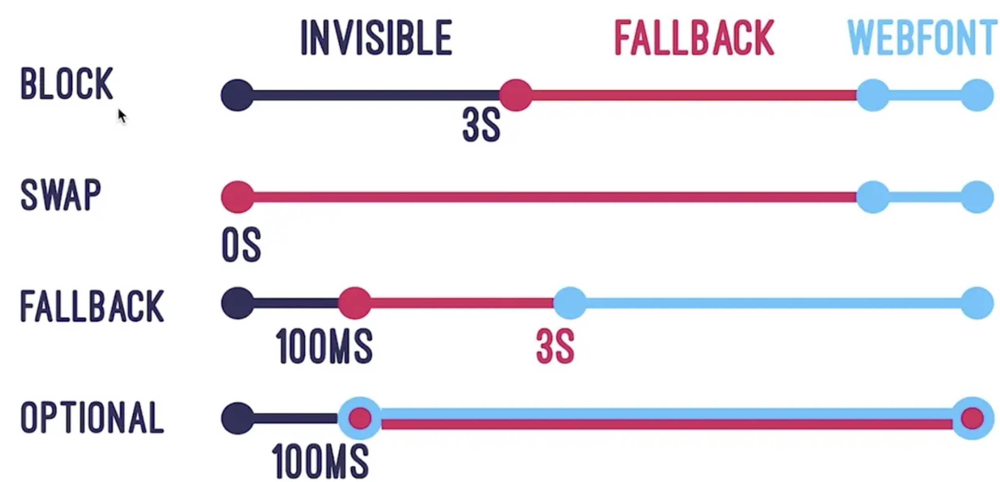

block一开始不让文字进行显示，3s后如果字体下载完成了就用该字体显示，如果3s后还没下载完就选择用默认字体代替。

swap-开始就用默认字体显示，直到需要的字体下载完成进行替换。

fallback是对block的优化，100ms之后根据字体是否下载完成选择展示默认字体或者需要的字体。

optional 100ms后如果字体还没下载完成用默认字体展示，即使字体下载完成也不更换了。

### 构建优化

#### webpack的优化配置

##### Tree-shaking

Tree-shaking是一种减少资源体积的办法。有很多的代码其实在最终生产的包里是用不到的，在打包前可以进行处理，把用不到的代码去掉。生产环境构建会默认开启Tree-shaking，其简单的工作原理是找到入口文件，入口相当于树的根节点，去看入口文件引用了什么东西。又会进一步去分析这些应用的包或者模块里面又引用了什么模块，不断地进行分析之后把所有需要的东西保留下来，把那些引入了但是没有用到的shaking下去，最后打包生成的bundle只包含运行时真正需要的代码。

但是Tree-shaking也有局限性，它需要基于ES6的模块化语法，但是有时候会涉及到在全局作用域上添加或者修改属性，export是体现不出来的，就会被shaking掉，代码就会出问题，我们可以告诉webpack哪些东西在Tree-shaking过程中不要去掉。在package.json中添加sideEffect，把所有不需要被shaking掉的文件放在sideEffect数组里。比如css不是用模块化方式去写的，有可能会被shaking掉，加入到sideEffect后webpack就不会把css代码去掉。``` sideEffect: ["*.css"] ```

最后还要注意babel配置的影响，我们通常会使用preset，preset就是把常用的babel插件做了一个集合，我们只用调用这个集合就可以使用这些插件。最常用的就是preset-env。preset有一个问题，做转码的时候会把ES6模块化的语法转成其他模块化的语法，我们肯定希望保留ES6的模块化语法，所以我们可以加一个modules的配置并设置为false，表示不需要转换成其他的模块化语法。这样Tree-shaking才能起到作用。

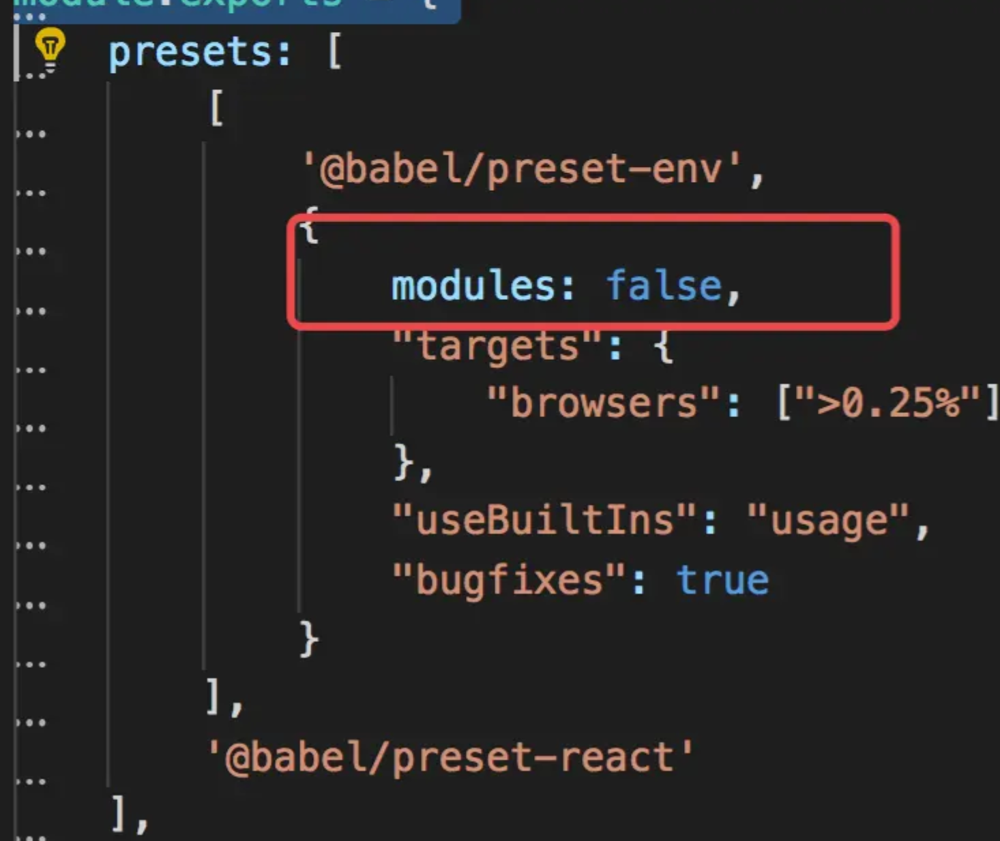

##### webpack依赖优化

对依赖进行优化可以提高webpack的打包速度，有两种方式可以提速webpack打包过程：

第一种是利用noParse参数提高构建速度。noParse的意思就是不解析，直接通知webpack忽略较大的库。如引用的第三方工具库，本身体积比较大，而且没有使用模块化的方式进行编写，本身也不会有外部的依赖，比较独立。那么就不对这样的库进行解析。
在module中配置noParse参数，设置loadsh，就告诉webpack不需要对loadsh进行递归解析。
``` module: { noParse: /lodash/ } ```

第二种方式通过DllPlugin插件，避免打包时对不变的库重复构建提高构建速度。比如项目中引入的react,react-dom，如果可以把它提取出来变成类似于动态链接库的引用，每一次构建不需要重复构建，只需要引用之前已经构建过的固定的东西就可以了。创建一个webpack.dll.config.js文件。entry包含了需要创建成动态链接库的类,通过webpack.DllPlugin生成动态链接文件的描述文件。

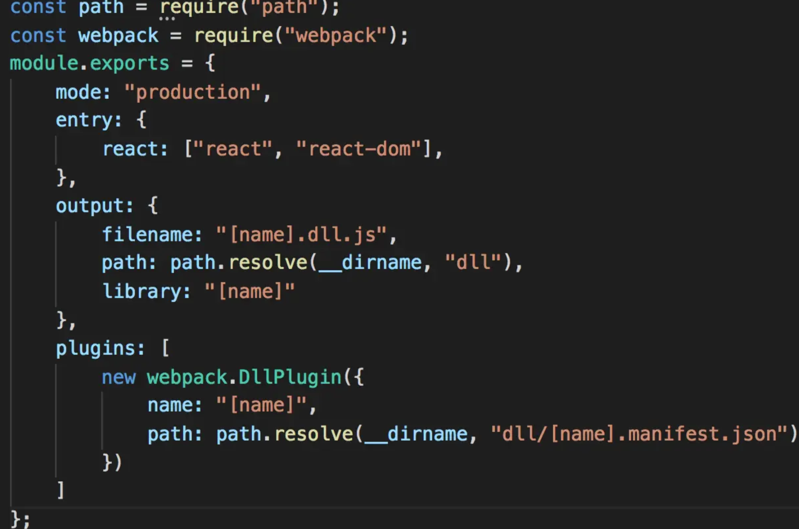

运行webpack.dll.config.js，生成如下动态链接文件react.dll.js和描述文件react.manifest.json。有了这个两个文件就可以对构建过程进行优化了。

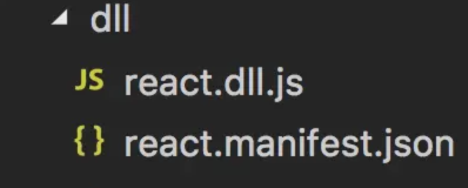

webpack.config.js中添加DllReferencePlugin插件引用上面生成的描述文件，这个描述文件会告诉webpack在构建过程中怎么找到动态链接文件。

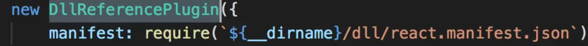

##### webpack代码拆分

对于大型的web应用，如果我们把所有的东西都打包到一起是十分低效和不可接受的。需要把bundle拆分成若干个小的bundles/chunks。把大的文件拆分成小的文件分散进行加载，先加载更重要的文件以缩短首屏加载时间，可提升用户体验。第一种方式在entry中添加其他入口，这样工程就会被拆分成多个不同的bundle。这种方式比较直接，但是需要手工去添加和维护。第二种方式通过splitChunks插件提取公有代码，拆分业务代码与第三方库。

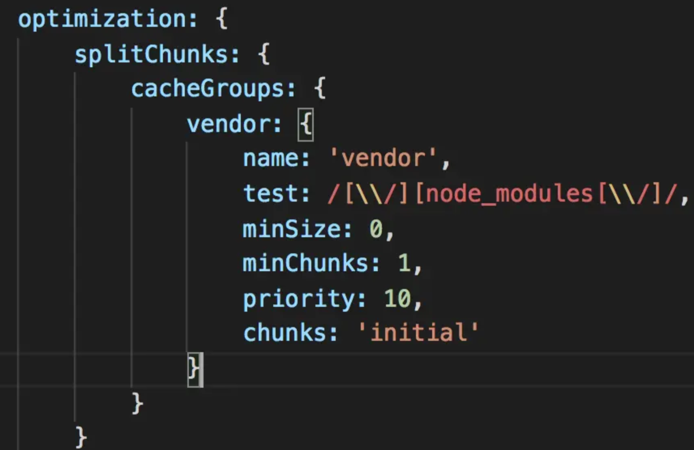

提取第三方库，拆分成独立的bundle。匹配node_modules中我们引入的库。构建后实际业务逻辑app.bundle.js体积明显减小了。同时会在build目录下生成vendor.bundle.js。这样就把所有的依赖给拆分出来了。

提取公共代码，匹配src下的文件：

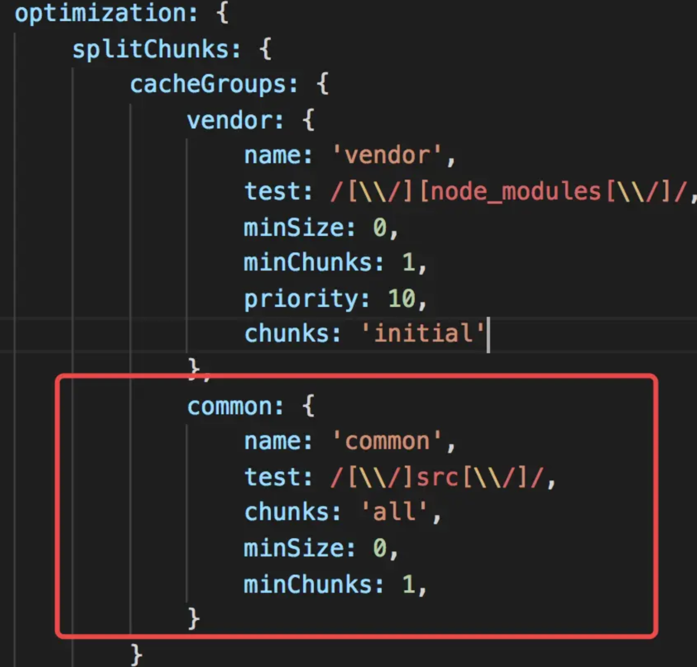

在入口文件index.jsx和index1.jsx中我都引入了a.js文件中的方法a并执行。打包后会在build目录下生成common.bundle.js。即把两个入口文件中的公共代码提取出来了。

##### webpack资源压缩

1. TerserPlugin压缩js。
2. mini-css-extract-plugin提取css，optimize-css-assets-webpack-plugin压缩css。
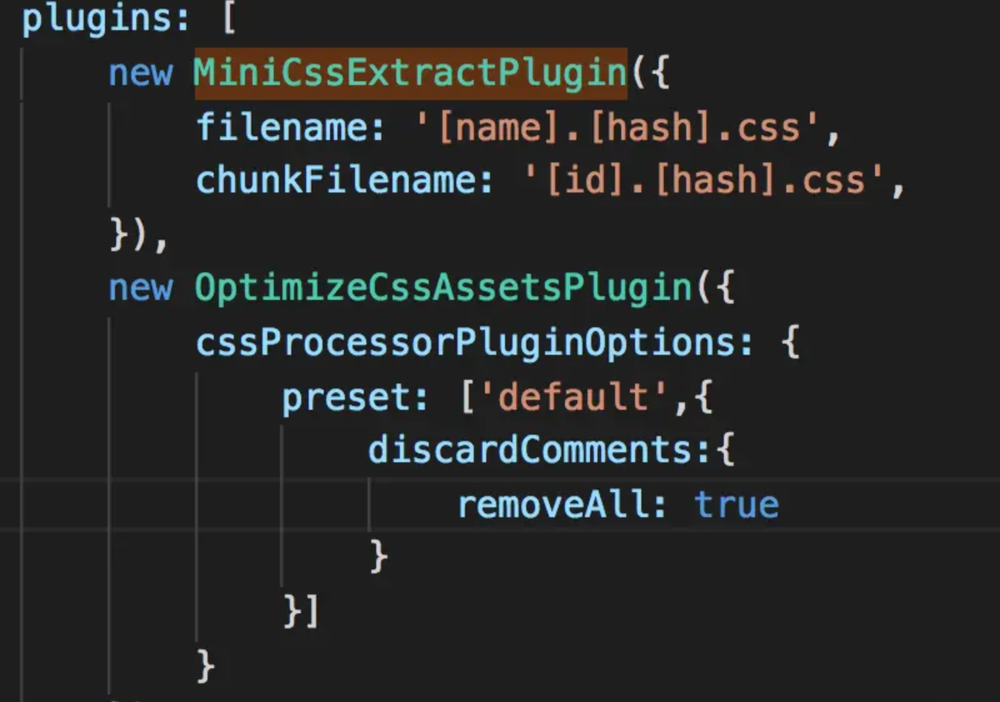
3. HtmlWebpackPlugin - minify压缩html。在生成模式下会默认启用minify。

#### webpack持久缓存

webpack构建文件时，可以在输出文件名称上添加hash，如果文件没有修改，hash值就不会发生变化，浏览器访问资源就会走缓存，如果发生变化，就可以做一个增量式的更新。``` [name].[hash].js ```

### 传输加载优化

#### 启用GZIP压缩

Gzip是用来进行网络资源压缩，减少资源文件在网络传输大小的技术,压缩比可高达90%。在网络传输过程中对资源进行实时的动态的压缩，Gzip是唯一可以选择的技术。Nginx配置实现Gzip。

#### 启用Keep Alive

http Keep Alive可以对TCP连接进行复用。当我们和服务器建立TCP连接之后，接下来的请求就不需要重复的去建立TCP连接了。
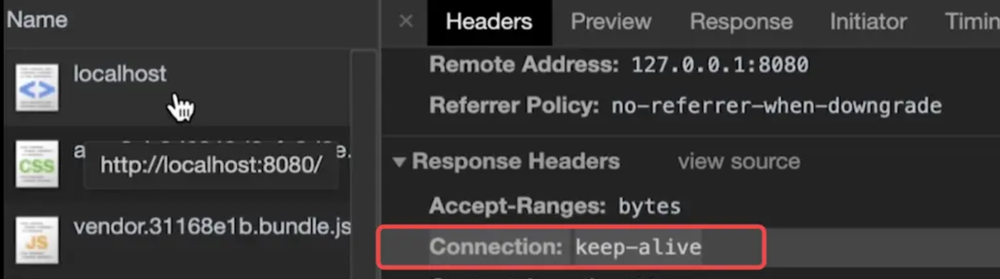

#### HTTP资源缓存

使用HTTP缓存主要是为了提高重复访问时资源加载的速度，提高用户体验。缓存方案：

- Cache-Control/Expires
- Last-Modified + If-Modified-Since
- Etag+If-None-Match 在ngnix配置文件中修改location部分添加缓存。
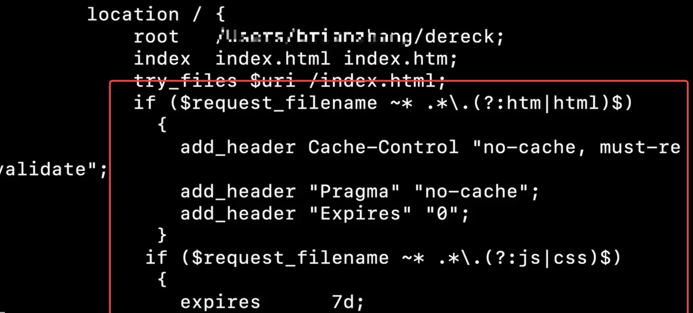
html是不希望被缓存的，配置Cache-Control "no-cache"不需要进行缓存。添加后面两个是为了兼容老版本http。

#### Service workers

Service worker是在客户端和服务端建立一个中间层，对资源进行存储，使用Service workers可以加速重复访问，并支持离线访问页面。可以让页面像原生应用一样在离线状态也能进行访问。

在webpack中如何配置Service workers？我们需要生成一个asset-manifest.json文件，使用webpack-manifest-plugin生成，这个文件定义了哪些资源需要缓存。

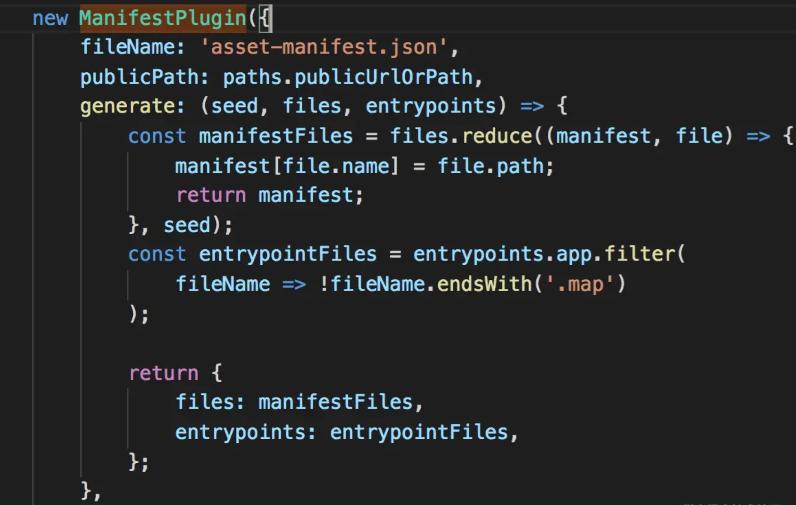

再使用workbox-webpack-plugin插件生成service-worker.js

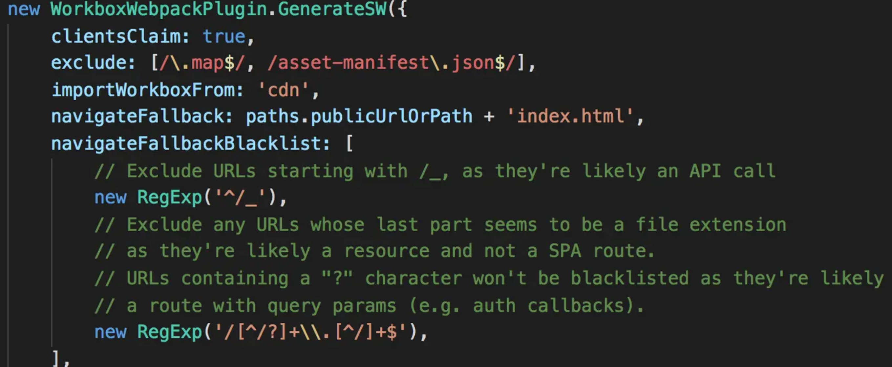

swUrl就是用workbox-webpack-plugin插件生成service-worker.js。调用Worker.register()就可以启动功能了。

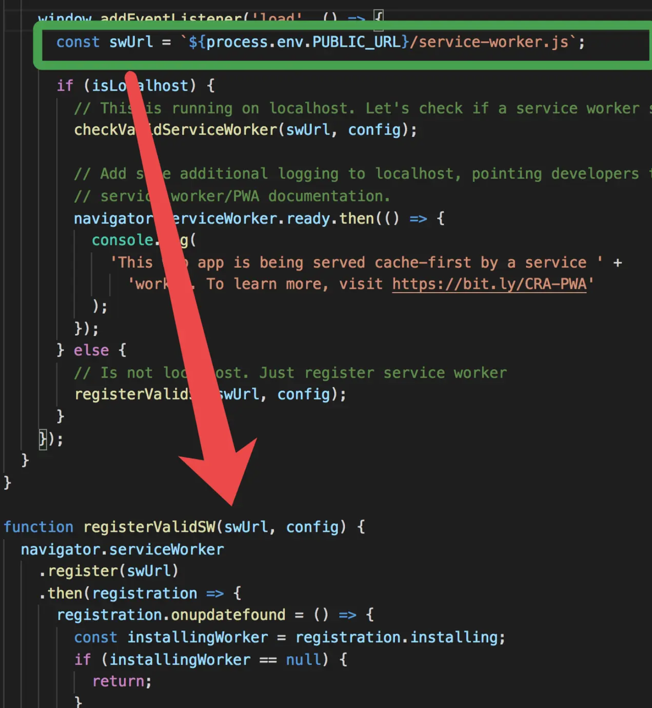

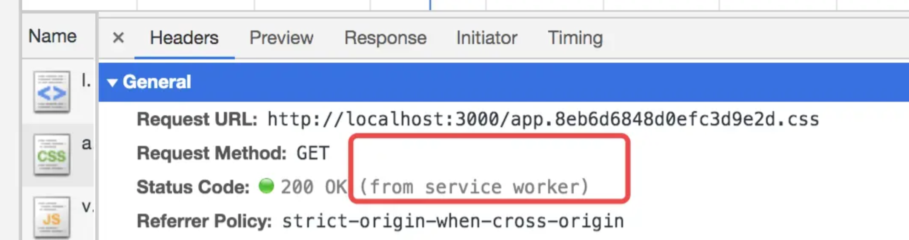

## Webpack和Vite

### JS手写代码案例

#### Object.create
