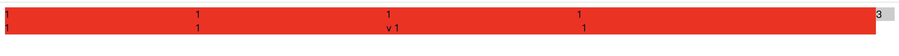
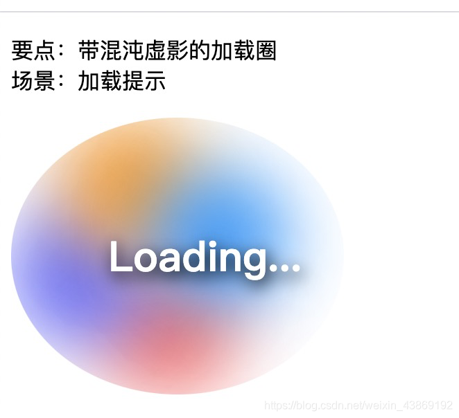

# 记录日常问题

## element中El-form-item嵌套popover显示问题

``` javascript
// 这种情况下，popover的内容不会正常划过显示出来，因为左右布局的el-form-item的label有float:left样式，影响到了它的展示
// 解决方案：1去掉el-form-item的浮动；2 form上添加label-position="top"属性，其实也是去掉浮动
<el-form :model="config" :rules="rules" size="mini">
    <el-form-item label="test"  prop="test">
        <span class="label" slot="label">
          test
          <el-popover
            placement="bottom-start"
            title="命名规则"
            content="1"
            effect="dark"
            trigger="hover">
              <i class="iconfont" slot="reference"></i>
          </el-popover>
        </span>
        <el-input/>
    </el-form-item>
</el-form>
```

## EleemntUI的输入框回车导致页面刷新弹框关闭

一、问题描述
element的弹框里面放一个input，当一个 form 元素中只有一个输入框时，回车时会触发浏览器提交事件，导致页面刷新，弹框关闭

二、解决办法

``` <el-form @submit.native.prevent> ```

三、兼容方案
如果弹框里面的input正好想绑定回车事件，如果用的是elemetui的el-input，@keyup.enter.native="方法名"

## vue-quill-editor 在vue2中禁用和启用

``` javascript
// 网上看到好多那种找dom元素禁用的，其实组件本身支持传入disabled，代码如下：
<quill-editor
      class="editor"
      :content="content"
      ref="myQuillEditor"
      :options="editorOption"
      :disabled="disabled"
    >
    </quill-editor>
```

## css-项目布局的时候左侧菜单和内容高度不一样 怎么对齐呢？



``` html
<!-- 2021-08-13 -->
<!DOCTYPE html>
<html>
<head>
	<title></title>
	<style type="text/css">
		span{
			width: 300px;
			display: inline-block;
		}
	</style>
</head>
<body>
	<div style="overflow: hidden;">
		<div style="float: right; background: #ccc;  width: 30px;">3</div>

		<div style=" background: red;margin-right: 30px">
			<span>1</span>
			<span>1</span>
			<span>1</span>
			<span>1</span>
			<span>1</span>
			<span>1</span>
			v
			<span>1</span><span>1</span>
		</div>

	</div>
</body>
</html>
```

## css 炫酷的loading图



```html
<!DOCTYPE html>
<html lang="en">
<head>
  <meta charset="UTF-8">
  <meta name="viewport" content="width=device-width, initial-scale=1.0">
  <meta http-equiv="X-UA-Compatible" content="ie=edge">
  <title>Document</title>
  <style>
    .chaos-loading {
      overflow: hidden;
      position: relative;
      border-radius: 100%;
      width: 200px;
      height: 200px;
    }
    .chaos-loading::after {
      display: block;
      -webkit-filter: drop-shadow(2px 4px 6px #000);
              filter: drop-shadow(2px 4px 6px #000);
      line-height: 200px;
      text-align: center;
      font-weight: bold;
      font-size: 30px;
      color: #fff;
      content: "Loading...";
    }
    .chaos-loading li {
      position: absolute;
      left: 0;
      top: 0;
      border-radius: 100%;
      width: 100px;
      height: 100px;
      -webkit-filter: blur(25px);
              filter: blur(25px);
      -webkit-animation: move 2s linear infinite;
              animation: move 2s linear infinite;
    }
    .chaos-loading li:nth-child(1) {
      background-color: #f66;
    }
    .chaos-loading li:nth-child(2) {
      background-color: #66f;
      -webkit-animation-delay: -500ms;
              animation-delay: -500ms;
    }
    .chaos-loading li:nth-child(3) {
      background-color: #f90;
      -webkit-animation-delay: -1s;
              animation-delay: -1s;
    }
    .chaos-loading li:nth-child(4) {
      background-color: #09f;
      -webkit-animation-delay: -1.5s;
              animation-delay: -1.5s;
    }

    @-webkit-keyframes move {
      0%,
      100% {
        -webkit-transform: translate3d(0, 0, 0);
                transform: translate3d(0, 0, 0);
      }
      25% {
        -webkit-transform: translate3d(100%, 0, 0);
                transform: translate3d(100%, 0, 0);
      }
      50% {
        -webkit-transform: translate3d(100%, 100%, 0);
                transform: translate3d(100%, 100%, 0);
      }
      75% {
        -webkit-transform: translate3d(0, 100%, 0);
                transform: translate3d(0, 100%, 0);
      }
    }

    @keyframes move {
      0%,
      100% {
        -webkit-transform: translate3d(0, 0, 0);
                transform: translate3d(0, 0, 0);
      }
      25% {
        -webkit-transform: translate3d(100%, 0, 0);
                transform: translate3d(100%, 0, 0);
      }
      50% {
        -webkit-transform: translate3d(100%, 100%, 0);
                transform: translate3d(100%, 100%, 0);
      }
      75% {
        -webkit-transform: translate3d(0, 100%, 0);
                transform: translate3d(0, 100%, 0);
      }
    }

  </style>
</head>
<body>
  <p>
    要点：带混沌虚影的加载圈<br>
    场景：加载提示
  </p>
  <div class="bruce flex-ct-x">
    <ul class="chaos-loading">
      <li></li>
      <li></li>
      <li></li>
      <li></li>
    </ul>
  </div>
</body>
</html>
```
