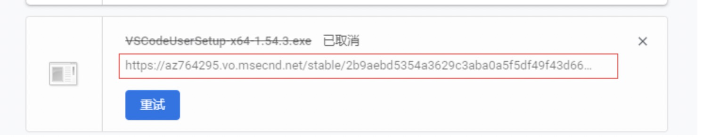

# 记录日常问题

## element中El-form-item嵌套popover显示问题

``` javascript
// 这种情况下，popover的内容不会正常划过显示出来，因为左右布局的el-form-item的label有float:left样式，影响到了它的展示
// 解决方案：1去掉el-form-item的浮动；2 form上添加label-position="top"属性，其实也是去掉浮动
<el-form :model="config" :rules="rules" size="mini">
    <el-form-item label="test"  prop="test">
        <span class="label" slot="label">
          test
          <el-popover
            placement="bottom-start"
            title="命名规则"
            content="1"
            effect="dark"
            trigger="hover">
              <i class="iconfont" slot="reference"></i>
          </el-popover>
        </span>
        <el-input/>
    </el-form-item>
</el-form>
```

## EleemntUI的输入框回车导致页面刷新弹框关闭

一、问题描述
element的弹框里面放一个input，当一个 form 元素中只有一个输入框时，回车时会触发浏览器提交事件，导致页面刷新，弹框关闭

二、解决办法

``` <el-form @submit.native.prevent> ```

三、兼容方案
如果弹框里面的input正好想绑定回车事件，如果用的是elemetui的el-input，@keyup.enter.native="方法名"

## vue-quill-editor 在vue2中禁用和启用

``` javascript
// 网上看到好多那种找dom元素禁用的，其实组件本身支持传入disabled，代码如下：
<quill-editor
      class="editor"
      :content="content"
      ref="myQuillEditor"
      :options="editorOption"
      :disabled="disabled"
    >
    </quill-editor>
```

## css-项目布局的时候左侧菜单和内容高度不一样 怎么对齐呢？


``` html
<!-- 2021-08-13 -->
<!DOCTYPE html>
<html>
<head>
	<title></title>
	<style type="text/css">
		span{
			width: 300px;
			display: inline-block;
		}
	</style>
</head>
<body>
	<div style="overflow: hidden;">
		<div style="float: right; background: #ccc;  width: 30px;">3</div>

		<div style=" background: red;margin-right: 30px">
			<span>1</span>
			<span>1</span>
			<span>1</span>
			<span>1</span>
			<span>1</span>
			<span>1</span>
			v
			<span>1</span><span>1</span>
		</div>

	</div>
</body>
</html>
```

## css 炫酷的loading图


```html
<!DOCTYPE html>
<html lang="en">
<head>
  <meta charset="UTF-8">
  <meta name="viewport" content="width=device-width, initial-scale=1.0">
  <meta http-equiv="X-UA-Compatible" content="ie=edge">
  <title>Document</title>
  <style>
    .chaos-loading {
      overflow: hidden;
      position: relative;
      border-radius: 100%;
      width: 200px;
      height: 200px;
    }
    .chaos-loading::after {
      display: block;
      -webkit-filter: drop-shadow(2px 4px 6px #000);
              filter: drop-shadow(2px 4px 6px #000);
      line-height: 200px;
      text-align: center;
      font-weight: bold;
      font-size: 30px;
      color: #fff;
      content: "Loading...";
    }
    .chaos-loading li {
      position: absolute;
      left: 0;
      top: 0;
      border-radius: 100%;
      width: 100px;
      height: 100px;
      -webkit-filter: blur(25px);
              filter: blur(25px);
      -webkit-animation: move 2s linear infinite;
              animation: move 2s linear infinite;
    }
    .chaos-loading li:nth-child(1) {
      background-color: #f66;
    }
    .chaos-loading li:nth-child(2) {
      background-color: #66f;
      -webkit-animation-delay: -500ms;
              animation-delay: -500ms;
    }
    .chaos-loading li:nth-child(3) {
      background-color: #f90;
      -webkit-animation-delay: -1s;
              animation-delay: -1s;
    }
    .chaos-loading li:nth-child(4) {
      background-color: #09f;
      -webkit-animation-delay: -1.5s;
              animation-delay: -1.5s;
    }

    @-webkit-keyframes move {
      0%,
      100% {
        -webkit-transform: translate3d(0, 0, 0);
                transform: translate3d(0, 0, 0);
      }
      25% {
        -webkit-transform: translate3d(100%, 0, 0);
                transform: translate3d(100%, 0, 0);
      }
      50% {
        -webkit-transform: translate3d(100%, 100%, 0);
                transform: translate3d(100%, 100%, 0);
      }
      75% {
        -webkit-transform: translate3d(0, 100%, 0);
                transform: translate3d(0, 100%, 0);
      }
    }

    @keyframes move {
      0%,
      100% {
        -webkit-transform: translate3d(0, 0, 0);
                transform: translate3d(0, 0, 0);
      }
      25% {
        -webkit-transform: translate3d(100%, 0, 0);
                transform: translate3d(100%, 0, 0);
      }
      50% {
        -webkit-transform: translate3d(100%, 100%, 0);
                transform: translate3d(100%, 100%, 0);
      }
      75% {
        -webkit-transform: translate3d(0, 100%, 0);
                transform: translate3d(0, 100%, 0);
      }
    }

  </style>
</head>
<body>
  <p>
    要点：带混沌虚影的加载圈<br>
    场景：加载提示
  </p>
  <div class="bruce flex-ct-x">
    <ul class="chaos-loading">
      <li></li>
      <li></li>
      <li></li>
      <li></li>
    </ul>
  </div>
</body>
</html>
```

## audio和video在ios和android中无法自动播放

应对方案：触屏即播 ```$('html').one("touchstart", function () {audio.play() } )```

## ElementUI的upload组件问题

一、问题1
upload有手动上传方式，当我用手动上传的时候，业务需求，需要传递两个参数，此时，可以在el-upload上加:data属性，是附带的参数。
当我手动submit（）之后，需要再次请求一次详情数据，因为submit方法是异步的，详情请求也是异步，所以，可能我详情的数据还是上一次的，解决办法：upload是有on-success方法的，可以在success之后再调详情接口。

二、问题2
页面特殊需求，需要三个upload组件，我同时写了三个，想着方法可以省一下，就用handleRemove('a')的方式传参来实现，结果出现问题，页面直接卡死，不知道为什么，但是把remove后面的括号传参去掉就可以了。

## ElementUI的日期时间组件使用问题

在ie浏览器下，使用日期组件无法回填，百度到有解决办法是去掉placeholder，试过并不管用。
解决办法：吧-替换为/就可以了，```data.content.businessStartTime =  data.content.businessStartTime ? data.content.businessStartTime.replace(/-/g, '/') : null```

## ElementUI的输入框回车刷新页面

当 el-form 表单内只有一个 el-input 输入框时，在输入框内回车就会触发表单的提交事件。或者当在dialog里面使用form嵌套input，第一个input回车会导致刷新.
解决办法在 el-form 上加上 ```@submit.native.prevent``` 属性就可以阻止回车提交事件。

## 开发官网，静态页面，弹框弹出，要求页面禁止滚动

解决办法：弹框弹出的时候，HTML设置overflow：hidden

## display：inline-block导致的问题

正常情况下，两个块元素需要同行，display：inline-block一定是选择之一，如果用了它，两个块元素之间就会有空隙，这个空隙的宽度是跟随字体大小来的，所以，你会发现，在不同电脑上显示不一样，或许会把另一个元素挤掉。
解决办法：把font-size设为0或者使用float。

## vue的$router.push不支持新打开标签页跳转

1. 页面添加一个a标签，宽高设为零或者隐藏，target属性为_blank，href变量或空 ```<a ref="target" href="" target="_blank"></a>```
2. 在想跳转的事件回调里面写

``` javascript
let target = this.$refs.target
 target.setAttribute('href', window.location.origin + '/home/integral-record')
target.click()
```

## 树形数据处理

- 深度优先遍历-递归，适用于找到就退出
- 广度优先遍历-for-forEach，适用于本身就需要遍历整个树
- 循环中如非清楚后果，否则不能直接更改源数据
- 使用map结构存储数据，多个地方使用，key唯一性

``` javascript
const tree = []
const array = [tree]
for (let index = 0; index !== array.length; index++) {
  // 处理业务逻辑
  array[index].forEach(item => {
    array.push(item.children)
  })
}
```

## 打印相关问题

- 发票单打印，用svg的图片，在打印预览的时候显示不出来，换用png或者jpg的可以。
- 对账单打印，前端写好html的模板，后端存入库，使用velocity模板引擎加入数据，转为pdf，输出到页面，其中备注因为文本比较多，正常的div等标签加换行样式无法做到让它自动换行。后来发现原生table的tr可以，换成tr就可以自适应的换行。

## MomentJS.format

moment.js包 时间格式化插件 format方法传入格式的时候需要区分大小写，标准YYYY-MM-DD HH:mm:ss，如果MM和SS大写会导致格式化出来的时间不对。

## ElementUI的El-form-item的label嵌套el的popover

```js
// 这种情况下，popover的内容不会正常划过显示出来，因为左右布局的el-form-item的label有float:left样式，影响到了它的展示
// 解决方案：1去掉el-form-item的浮动；2 form上添加label-position="top"属性，其实也是去掉浮动
<el-form :model="config" :rules="rules" size="mini">
    <el-form-item label="test"  prop="test">
        <span class="label" slot="label">
          test
          <el-popover
            placement="bottom-start"
            title="命名规则"
            content="1"
            effect="dark"
            trigger="hover">
              <i class="iconfont" slot="reference"></i>
          </el-popover>
        </span>
        <el-input/>
    </el-form-item>
</el-form>
```

## window国内下载vscode速度慢问题解决

首先在官网找到需要下载的文件，点击下载。
在浏览器或者下载软件中就可以看到这么一个下载地址了，将其复制下来（如下图箭头所指）。


然后将红框内的部分更换为如下内容：
vscode.cdn.azure.cn <--------就是左边这个
更新后的地址为：vscode.cdn.azure.cn/stable/78a4c91400152c0f27ba4d363eb56d2835f9903a/VSCodeUserSetup-x64-1.43.0.exe
这个就是国内的镜像了点开后你会发现速度直接起飞。

mac的下载链接按照lz指导改成vscode.cdn.azure.cn/stable/78a4c91400152c0f27ba4d363eb56d2835f9903a/VSCodeUserSetup-x64-1.43.0.exe

## 运营平台-钉钉扫码登录第三方网站-二维码内嵌

官方文档
<https://ding-doc.dingtalk.com/doc#/serverapi2/kymkv6/P6S1w>

步骤

1. 先根据官方文档获取appId
2. 页面引入官方js文件
```<script src="https://g.alicdn.com/dingding/dinglogin/0.0.5/ddLogin.js"></script>```
3. 代码实现

```js
<template>
  <div class="member-login">
    <div id="login_container"></div>
  </div>
</template>

<script>
export default {
  mounted () {
    this.ddlogin()
  },
  methods: {
    ddlogin () {
      /*
      * 解释一下goto参数，参考以下例子：
      * var url = encodeURIComponent('http://localhost.me/index.php?test=1&aa=2');
      * var goto = encodeURIComponent('https://oapi.dingtalk.com/connect/oauth2/sns_authorize?appid=appid&response_type=code&scope=snsapi_login&state=STATE&redirect_uri='+url)
      */
      var url = encodeURIComponent('http://127.0.0.1:8083/#/portal')
      /* global DDLogin */
      DDLogin({
        id: 'login_container',
        goto: encodeURIComponent('https://oapi.dingtalk.com/connect/oauth2/sns_authorize?appid=appid&response_type=code&scope=snsapi_login&state=STATE&redirect_uri=' + url), //请参考注释里的方式
        style: '', // 自定义二维码样式
        width: '100',
        height: '100'
      })
      var handleMessage = function (event) {
        var origin = event.origin
        if (origin === 'https://login.dingtalk.com') { // 判断是否来自ddLogin扫码事件。
          var loginTmpCode = event.data // 拿到loginTmpCode后就可以在这里构造跳转链接进行跳转了
          let goback = 'https://oapi.dingtalk.com/connect/oauth2/sns_authorize?appid=appid&response_type=code&scope=snsapi_login&state=STATE&redirect_uri=' + url + '&loginTmpCode=' + loginTmpCode
          // 在这儿，官方文档说的是需要解码，实际上不需要
          window.location.href = goback
        }
      }
      // 监听扫码
      if (typeof window.addEventListener !== 'undefined') {
        window.addEventListener('message', handleMessage, false)
      } else if (typeof window.attachEvent !== 'undefined') {
        window.attachEvent('onmessage', handleMessage)
      }
    }
  }
}
</script>
```
