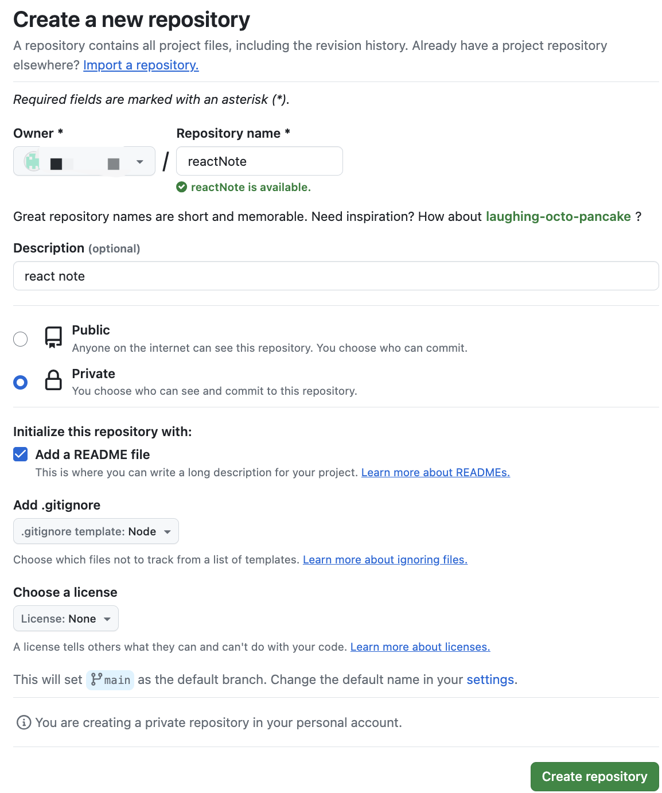

# react在git站点部署

## 在github创建项目



创建完成之后，clone到本地开发项目。进入项目根目录，执行```yarn init -y```初始化package.json文件。

## package.json

``` json

```

## 创建vite.config.ts配置文件

``` js
import { defineConfig } from 'vitest/config'
import { resolve } from 'path'
import eslint from '@nabla/vite-plugin-eslint'
import react from '@vitejs/plugin-react-swc'
import { visualizer } from 'rollup-plugin-visualizer'
import { type PluginOption } from 'vite'

export default defineConfig({
  base: './',
  server: {
    port: 3000,
  },
  plugins: [
    react({ tsDecorators: true }),
    eslint(),
    // 可视化并分析您的 Rollup 包，看看哪些模块占用了空间。
    visualizer({ filename: './visualizer/index.html' }) as PluginOption,
  ],
  css: {
    modules: {
      // 构建时 生成自定义类
      generateScopedName: '[local]-[hash:base64:5]',
      // 在react中，经常会在js中书写class，一般class使用中划线，写在js中不优雅，可以用这个配置
      // dashes表示只在js中使用时通过驼峰引用
      localsConvention: 'dashes',
    },
    postcss: {
      plugins: [
        postcssNest(),
        postcssPresetEnv({
          stage: 3,
          autoprefixer: {
            flexbox: 'no-2009',
          },
        }),
      ],
    },
  },
  test: {
    include: ['src/**/*.{test, spec}.{js,jsx,ts,tsx}'],
    environment: 'jsdom',
    globals: true,
  },
  resolve: {
    alias: {
      '@styles': resolve(__dirname, 'src/styles'),
      '@assets': resolve(__dirname, 'src/assets'),
      '@routes': resolve(__dirname, 'src/routes'),
      '@apis': resolve(__dirname, 'src/apis'),
      '@components': resolve(__dirname, 'src/components'),
      '@hooks': resolve(__dirname, 'src/hooks'),
      '@pages': resolve(__dirname, 'src/pages'),
      '@stores': resolve(__dirname, 'src/stores'),
      '@models': resolve(__dirname, 'src/models'),
      '@utils': resolve(__dirname, 'src/utils'),
    },
  }
})
```

### 可视化并分析 Rollup 包占用空间

这里使用[Rollup Plugin Visualizer](https://github.com/btd/rollup-plugin-visualizer)包提供功能。在vite.config.ts这种ts配置文件中需要如下用法：

```js
import { defineConfig, type PluginOption } from 'vite'
export default defineConfig({
  plugins: [visualizer() as PluginOption],
})
```

可以有扩展配置，这里配置了filename，带有要生成的图表的文件的名称。

### [css配置](/reactNotes/gitSiteArrange/viteCssConfig.html)

## 创建其他vite项目文件

### index.html

```html
<!doctype html>
<html lang="en">
  <head>
    <meta charset="UTF-8" />
    <link rel="icon" type="image/svg+xml" href="/src/favicon.svg" />
    <meta name="viewport" content="width=device-width, initial-scale=1.0" />
    <title>Vite App</title>
  </head>
  <body>
    <div id="root"></div>
    <script type="module" src="/src/index.tsx"></script>
  </body>
</html>
```

### package.json添加

1. script命令

    ```json
    "scripts": {
      "dev": "vite",
      "build": "vite build",
      "preview": "vite preview",
      "test": "vitest"
    },
    ```

2. browserslist

    ```json
      "browserslist": {
        "production": [
          ">= 5%",
          "not dead",
          "not ie <= 11"
        ],
        "development": [
          "last 1 chrome version",
          "last 1 firefox version",
          "last 1 safari version"
        ]
      },
    ```

根据提供的目标浏览器的环境来，智能添加css前缀，js的polyfill垫片,来兼容旧版本浏览器。避免不必要的兼容代码，以提高代码的编译质量。共享[使用browserslist的组件们](https://github.com/browserslist/browserslist)：Autoprefixer（postcss添加css前缀组件）、bable-preset-env（编译预设环境 智能添加polyfill垫片代码）、postcss-preset-env、postcss-normalize等。

只要package.json配置了browserslist对象,需要的组件将自动匹配到并使用,也可以配置到具体的组件参数上，这里分别配置了生产环境和开发环境。

| 配置                    | 描述    |
|-------------------------|-----------|
| ">= 5%"                 | 全球超过等于5%人使用的浏览器                     |
| "last 1 chrome version" | chrome浏览器兼容到最后1个版本根据caniuse.com追踪的版本      |
| "not dead"              | 24个月没有官方支持或更新的浏览器。 目前它是IE 11等，更多[查询](https://github.com/browserslist/browserslist) |

3. npm依赖

    ```json
    "dependencies": {
      "@tanstack/react-query": "^5.7.2",
      "axios": "^1.6.0",
      "classnames": "^2.3.2",
      "react": "^18.2.0",
      "react-dom": "^18.2.0",
      "react-router-dom": "^6.18.0"
    },
    "devDependencies": {
      "@commitlint/cli": "^18.2.0",
      "@commitlint/config-conventional": "^18.1.0",
      "@nabla/vite-plugin-eslint": "^1.5.0",
      "@testing-library/dom": "^9.3.3",
      "@testing-library/react": "^14.0.0",
      "@testing-library/user-event": "^14.5.1",
      "@total-typescript/ts-reset": "^0.5.1",
      "@types/node": "^20.8.10",
      "@types/react": "^18.2.35",
      "@types/react-dom": "^18.2.14",
      "@types/react-router-dom": "^5.3.3",
      "@types/react-test-renderer": "^18.0.5",
      "@types/rollup-plugin-visualizer": "^4.2.2",
      "@typescript-eslint/eslint-plugin": "^6.9.1",
      "@typescript-eslint/parser": "^6.9.1",
      "@vitejs/plugin-react-swc": "^3.4.1",
      "browserslist-to-esbuild": "^1.2.0",
      "commitizen": "^4.3.0",
      "cross-env": "^7.0.3",
      "cypress": "^13.4.0",
      "cz-conventional-changelog": "^3.3.0",
      "editorconfig": "^2.0.0",
      "eslint": "^8.53.0",
      "eslint-config-prettier": "^9.0.0",
      "eslint-config-proste": "^9.1.0",
      "eslint-plugin-cypress": "^2.15.1",
      "eslint-plugin-import": "^2.29.0",
      "eslint-plugin-import-newlines": "^1.3.4",
      "eslint-plugin-react": "^7.33.2",
      "eslint-plugin-react-hooks": "^4.6.0",
      "husky": "^8.0.3",
      "jsdom": "^22.1.0",
      "lint-staged": "^15.0.2",
      "postcss": "^8.4.31",
      "postcss-nesting": "^12.0.1",
      "postcss-preset-env": "^9.3.0",
      "prettier": "^3.0.3",
      "react-test-renderer": "^18.2.0",
      "rollup-plugin-visualizer": "^5.9.2",
      "standard-version": "^9.5.0",
      "stylelint": "^15.11.0",
      "stylelint-config-recess-order": "^4.3.0",
      "stylelint-config-standard": "^34.0.0",
      "swc-plugin-react-remove-properties": "^0.1.4",
      "typescript": "^5.2.2",
      "vite": "^4.5.0",
      "vitest": "^0.34.6"
    }
    ```

    - @tanstack/react-query 它使 React 程序中的获取，缓存，同步和更新服务器状态变得轻而易举[文档](https://cangsdarm.github.io/react-query-web-i18n/react/)
    - classnames 一个简单的 JavaScript 实用程序，用于有条件地将类名连接在一起
    - 规范commit格式：commitizen & cz-conventional-changelog [分析](https://juejin.cn/post/6990307028162281508)
        - commitizen/cz-cli：需要借助它提供的 git cz 命令替代 git commit 命令, 帮助生成符合规范的 commit message.
        - cz-conventional-changelog做为 commitizen 指定的 Adapter，使得 commitizen 按照指定的规范帮助我们生成 commit message。
    - 校验commit格式：@commitlint/config-conventional & @commitlint/cli & husky
        - commitlint: 可以帮助我们 lint commit messages, 如果提交的不符合指向的规范, 直接拒绝提交。
        - @commitlint/config-conventional ：作为校验的配置。
        - husky：提供git hook。
    - @nabla/vite-plugin-eslint 将 ESLint 插入 Vite 开发服务器 TODO
    - 
